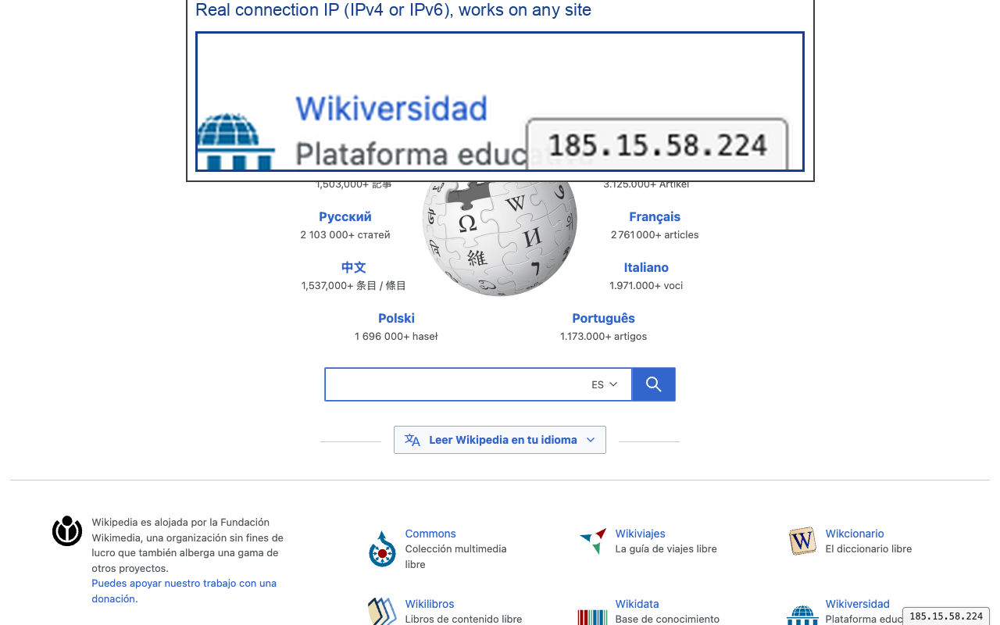

# Site IP Badge

A tiny Chrome extension (Manifest V3) that shows the IP address of the server that delivered the page you are looking at, as a small badge in the bottom-right corner of every `http://` and `https://` page.

It is a from-scratch replacement for the abandoned [Website IP](https://chromewebstore.google.com/detail/website-ip/ghbmhlgniedlklkpimlibbaoomlpacmk) extension (last updated May 2024), which keeps its data in the service worker's memory and shows `null` once Chrome suspends the worker. See [docs/diagnosis.md](docs/diagnosis.md) for the analysis.



## Features

- **Real connection IP.** The address comes from the HTTP response the browser actually received (`chrome.webRequest.onResponseStarted` → `details.ip`), so it reflects CDNs, load balancers and redirects, not just what DNS says. IPv4 and IPv6 (`[2001:db8::1]`).
- **Stays out of the way.** Hover the badge and it jumps to the other corner. It stays there for about a second so you can follow it and click.
- **Click to copy**, **double click to hide** until the page is reloaded.
- **Survives service-worker suspension.** IPs are stored per tab and host in `chrome.storage.session`, which outlives the worker and is wiped when the browser closes.
- **DNS fallback with a visible marker.** When no connection IP is available (a tab restored after a restart, a page served from cache), the extension can resolve the host through DNS over HTTPS (`dns.google`) and tags the badge with `DNS` so you know it is not the connection address. Can be switched off.
- **Options:** corner (left/right), font size, DNS fallback on/off. Synced through `chrome.storage.sync`.
- **Shadow DOM badge.** Page CSS cannot restyle it and it cannot leak styles into the page. Works on strict-CSP sites such as github.com.
- **No build step, no dependencies, no telemetry, no remote code.** Plain JavaScript. See [PRIVACY.md](PRIVACY.md).
- English and Spanish UI.

## Installation

The extension is not on the Chrome Web Store yet. Until it is, install it from a release:

1. Download `site-ip-badge-<version>.zip` from the [latest release](https://github.com/lcajigasm/site-ip-badge/releases/latest).
2. Unzip it somewhere permanent (Chrome loads the extension from that folder every time it starts, so do not delete it afterwards). You should end up with a folder that contains `manifest.json` directly.
3. Open `chrome://extensions` (Brave: `brave://extensions`, Edge: `edge://extensions`).
4. Turn on **Developer mode** (top-right switch).
5. Click **Load unpacked** and pick the folder from step 2.
6. Open any `https://` page. The IP appears in the bottom-right corner.

Chrome shows a "Disable developer mode extensions" prompt on startup while an unpacked extension is installed. That is expected for extensions installed outside the Web Store; dismiss it or install from the store once it is published.

To update, download the new zip, unzip it over the same folder and press the reload icon on the extension's card in `chrome://extensions`.

### From source

```sh
git clone https://github.com/lcajigasm/site-ip-badge.git
```

Then follow steps 3 to 6 above and pick the `src/` folder.

## Usage

| Action | Result |
|---|---|
| Hover the badge | It jumps to the other bottom corner. It will not jump again for ~1.2 s so you can click it. |
| Click | Copies the IP to the clipboard. The badge flashes green. |
| Double click | Hides the badge until the page is reloaded. |
| Toolbar icon | Opens the options page. |

Badge variants:

| Look | Meaning |
|---|---|
| `172.66.147.243` | IP of the connection that delivered the main document. |
| `[2a00:1450:4003:810::200e]` | Same, IPv6. |
| `104.20.21.8` with a `DNS` tag and a dashed border | Connection IP not available; this is a DNS answer for the host. |
| `IP ?` (grey) | No connection IP and the DNS fallback is disabled. |

Hovering shows a tooltip with the host and where the address came from.

## How it works

```
browser loads a main-frame document
        │
        ▼
background.js  webRequest.onResponseStarted (types: main_frame)
        │      details.ip → storage.session["tab:<id>"].hosts[<host>]
        │      (cached responses carry no ip: previous IP for the host is kept and marked stale)
        ▼
content.js     runs at document_idle in the top frame only
        │      sendMessage({ type: "GET_IP" })
        ▼
background.js  looks up sender.tab.id + host of sender.url
               → connection IP, or IP literal, or DNS-over-HTTPS fallback, or null
        │
        ▼
content.js     renders the badge inside a Shadow DOM host with position: fixed
```

Entries are removed when the tab closes (`chrome.tabs.onRemoved`). Only the last six hosts per tab are kept, which covers redirects, prerendering and back/forward cache.

### Permissions

| Permission | Why |
|---|---|
| `webRequest` | Read `details.ip` from `onResponseStarted` for main-frame documents. Observation only; nothing is blocked or modified. |
| `<all_urls>` (host permission) | Observe the main-frame response of any site and inject the badge on any http/https page. |
| `storage` | Keep the IP per tab in `storage.session` and the preferences in `storage.sync`. |

## Repository layout

```
src/                 the extension (load this folder unpacked)
  manifest.json
  background.js      service worker: webRequest listener, storage.session, DNS fallback, message handler
  content.js         badge rendering in a Shadow DOM
  content.css        host-element positioning safety net
  options.html/js/css
  _locales/en, es
  icons/
scripts/zip.sh       builds dist/site-ip-badge-<version>.zip (manifest.json at the zip root)
test/                Playwright end-to-end suite (see below)
docs/
  diagnosis.md       why the original extension broke (Spanish)
  store-listing.md   Chrome Web Store listing text and permission justifications
  screenshots/       1280×800 store screenshots
  store/             128×128 store icon with margin
PUBLISH.md           step-by-step Chrome Web Store publishing guide (Spanish)
PRIVACY.md           privacy policy
```

## Development

There is no build step. Edit the files in `src/` and press the reload icon on the extension's card in `chrome://extensions`.

### Tests

The `test/` folder contains a Playwright harness that loads `src/` into Chrome for Testing and drives real sites and a local server:

```sh
cd test
npm install        # also downloads Chrome for Testing
npm test
```

It checks IPv4 and IPv6 (`[::1]` loopback server) connections, `history.pushState`, 301 redirects, strict CSP pages, iframes (the badge must show the main frame's IP), hover/click/double-click behaviour, options, a stopped service worker, the DNS fallback, IP-literal hosts, `about:blank` / `chrome://` / `file://` pages, tab cleanup and the absence of errors.

Useful variables:

```sh
BROWSER_PATH="/Applications/Brave Browser.app/Contents/MacOS/Brave Browser" npm test   # another Chromium
EXT=/path/to/unzipped/package npm test                                                # test a built zip
HEADED=1 npm test                                                                     # watch it run
npm run screenshots                                                                   # regenerate docs/screenshots
```

Note: branded Google Chrome 137 and later ignores `--load-extension`, so the suite uses Chrome for Testing, Chromium, Brave or Edge.

### Building the package

```sh
scripts/zip.sh
# → dist/site-ip-badge-1.0.0.zip
```

Requires `jq` and `zip`.

### Publishing to the Chrome Web Store

Follow [PUBLISH.md](PUBLISH.md). The listing text, single-purpose statement and permission justifications are ready in [docs/store-listing.md](docs/store-listing.md).

## Browser support

Chrome 112+, and Chromium-based browsers with Manifest V3 support (Brave, Edge, Vivaldi, Opera). Tested on Chrome for Testing 153 and Brave. Firefox and Safari are out of scope for now (Firefox has `webRequest`, so a port would be small).

## Privacy

No data collection, no analytics, no remote code. The only optional network request is the DNS fallback to `dns.google`, which receives just the host name of the page and can be disabled in the options. Full text in [PRIVACY.md](PRIVACY.md).

## License

[MIT](LICENSE)
